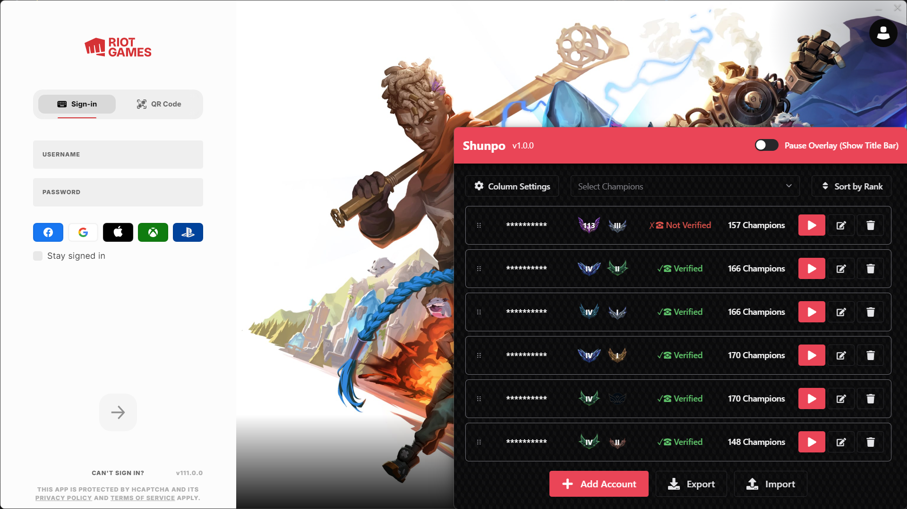

<div align="center">


<h1> SHUNPO  </h1>

*A no hassle League of Legends account manager*

[](https://github.com/FlayInAHook/shunpo/releases) [](https://github.com/FlayInAHook/shunpo/releases/latest) [](#license) [](https://discordapp.com/users/386537086859214858)

[](https://www.electronjs.org/) [](https://reactjs.org/) [](https://www.typescriptlang.org/) [](https://chakra-ui.com/)

</div>

---

## ✨ Features

- 🎮 **Multi-Account Management** - Seamlessly manage multiple League of Legends accounts
- 🏆 **Account Information** - Tracks the name, rank, phone verification and number of champions for each account
- 🎨 **Integrated UI** - Clean, responsive interface overlayed directly on your league client
- 🔄 **Auto-Start & Updates** - Automatic startup and updates make the usage frictionless



## Download

[Shunpo can be downloaded from the latest release for Windows!](https://github.com/FlayInAHook/shunpo/releases)

## Development

```bash
set BUILD_TEST=true
#alternative for powershell $ENV:BUILD_TEST=true
bun run dev
```

### Building

```bash
# Build for Windows
bun run build:win
```

## Project Structure

```
shunpo/
├── src/
│   ├── main/           # Electron main process
│   ├── preload/        # Preload scripts
│   └── renderer/       # React frontend
├── build/              # Build assets
├── resources/          # App resources
└── scripts/            # Build scripts
```

## Requirements

- Windows 10/11
- League of Legends

## License

This project is licensed under the MIT License - see the [LICENSE](LICENSE) file for details.

## Credits

- **LCU API**: [hasagi-core](https://github.com/dysolix/hasagi-core) - League Client Update API integration
- **Original Overlay**: [electron-overlay-window](https://github.com/SnosMe/electron-overlay-window) - Base overlay implementation

---

<div align="center">
  
**⭐ Star this repository if you find it helpful!**

Made with ❤️ by [FlayInAHook](https://github.com/FlayInAHook)

</div>
